# Fashion-MNIST-classification
use CNN neural network on Fashion-MNIST dataset 
 # data set
 data set link: https://www.kaggle.com/datasets/zalando-research/fashionmnist
 
# steps
## Prepare the data
The dataset consists of a training set of 60,000 examples and a test set of 10,000 examples. Each example is a 28x28 grayscale image, associated with a label from 10 classes (0 to 9).\
Labels: \
•	0 T-shirt/top \
•	1 Trouser \
•	2 Pullover \
•	3 Dress \
•	4 Coat \
•	5 Sandal \
•	6 Shirt \
•	7 Sneaker \
•	8 Bag \
•	9 Ankle boot 

a)	clean the data (remove the duplicates, and empty cells) \
b)	data visualization \
the train set: \
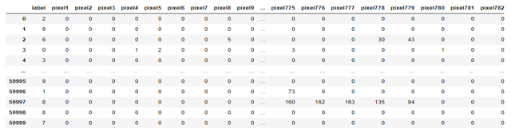 \
The Test set: \
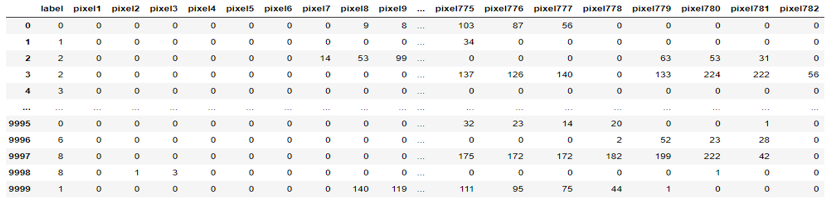 \
Images from train set: \
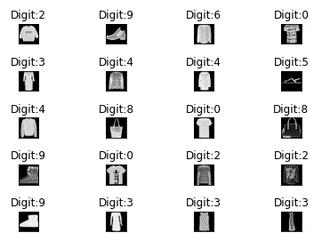 \
Images from test set: \
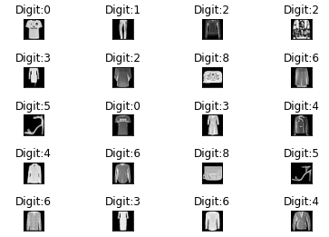 
 

The Distribution of digits in train set: \
 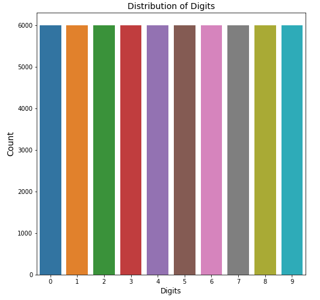 

The Distribution of digits in test set: \
 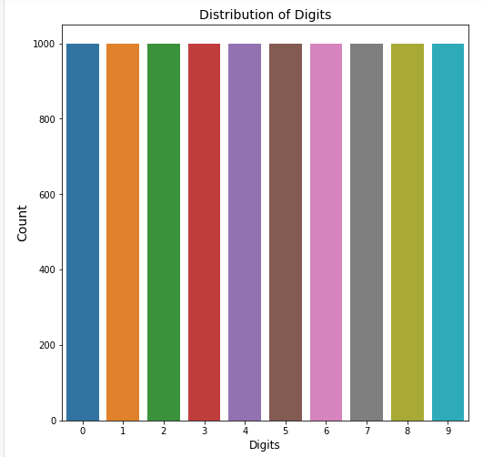 
 
**Train dataset, and test dataset are balanced datasets.** 

c)	Encode the labels and reshaped the features (so that I can use them in CNN)

d)	The Correlation analysis
For train data:
label    pixel1    pixel2    pixel3    pixel4    pixel5  \
label     1.000000 -0.000676  0.002942 -0.010453 -0.007119 -0.004629   
pixel1   -0.000676  1.000000  0.297899  0.067551  0.046607  0.026630   
pixel2    0.002942  0.297899  1.000000  0.575033  0.138709  0.054353   
pixel3   -0.010453  0.067551  0.575033  1.000000  0.387468  0.118136   
pixel4   -0.007119  0.046607  0.138709  0.387468  1.000000  0.573172   
...            ...       ...       ...       ...       ...       ...   
pixel780 -0.066846 -0.002442 -0.002341 -0.001494  0.010101  0.021514   
pixel781 -0.018054 -0.000109  0.004271  0.006861  0.023940  0.025971   
pixel782  0.045588  0.008764  0.014215  0.013151  0.012388  0.028859   
pixel783  0.059963  0.026388  0.021296  0.009946  0.003072  0.022939   
pixel784  0.021773  0.041581  0.022161  0.015657  0.008422  0.007124   

            pixel6    pixel7    pixel8    pixel9  ...  pixel775  pixel776  \
label    -0.011058 -0.036828 -0.085385 -0.161761  ... -0.362817 -0.258533   
pixel1    0.026172  0.012096  0.012225  0.009644  ... -0.000641  0.004628   
pixel2    0.033184  0.022766  0.017138  0.016821  ...  0.000494  0.004861   
pixel3    0.087300  0.060937  0.035942  0.029674  ...  0.010095  0.016706   
pixel4    0.325683  0.242987  0.141033  0.085302  ...  0.009690  0.018710   
...            ...       ...       ...       ...  ...       ...       ...   
pixel780  0.032318  0.027065  0.019507  0.024986  ... -0.074218 -0.008964   
pixel781  0.038560  0.030478  0.026278  0.034245  ... -0.042288  0.008640   
pixel782  0.044113  0.029461  0.022747  0.020991  ... -0.002795  0.034103   
pixel783  0.030802  0.016128  0.005947  0.000090  ...  0.001906  0.026552   
pixel784  0.004948  0.001792  0.000594  0.000285  ...  0.016611  0.028407   

          pixel777  pixel778  pixel779  pixel780  pixel781  pixel782  \
label    -0.183235 -0.090386 -0.077161 -0.066846 -0.018054  0.045588   
pixel1    0.004609  0.000975 -0.002305 -0.002442 -0.000109  0.008764   
pixel2    0.006817  0.002097 -0.004427 -0.002341  0.004271  0.014215   
pixel3    0.018323  0.006163 -0.003821 -0.001494  0.006861  0.013151   
pixel4    0.023391  0.016759  0.009700  0.010101  0.023940  0.012388   
...            ...       ...       ...       ...       ...       ...   
pixel780  0.043000  0.336772  0.790184  1.000000  0.749621  0.349134   
pixel781  0.045504  0.131133  0.439563  0.749621  1.000000  0.645871   
pixel782  0.074004  0.092843  0.152620  0.349134  0.645871  1.000000   
pixel783  0.054235  0.077767  0.101160  0.178656  0.334548  0.658959   
pixel784  0.037324  0.044528  0.047773  0.073421  0.133829  0.225500   

          pixel783  pixel784  
label     0.059963  0.021773  
pixel1    0.026388  0.041581  
pixel2    0.021296  0.022161  
pixel3    0.009946  0.015657  
pixel4    0.003072  0.008422  
...            ...       ...  
pixel780  0.178656  0.073421  
pixel781  0.334548  0.133829  
pixel782  0.658959  0.225500  
pixel783  1.000000  0.451929  
pixel784  0.451929  1.000000  

for test data:

      label    pixel1    pixel2    pixel3    pixel4    pixel5  \
label     1.000000  0.002841 -0.003617 -0.003109 -0.009322 -0.007137   
pixel1    0.002841  1.000000  0.046329  0.006207  0.006825  0.002768   
pixel2   -0.003617  0.046329  1.000000  0.978786  0.740031  0.391098   
pixel3   -0.003109  0.006207  0.978786  1.000000  0.741953  0.365044   
pixel4   -0.009322  0.006825  0.740031  0.741953  1.000000  0.683970   
...            ...       ...       ...       ...       ...       ...   
pixel780 -0.072360  0.012562  0.026270  0.029892  0.008501 -0.002638   
pixel781 -0.021238  0.019814  0.046270  0.051873  0.015893  0.001018   
pixel782  0.037482  0.024084  0.099349  0.104852  0.040821  0.018157   
pixel783  0.056823  0.009018  0.041088  0.041215  0.006930  0.002094   
pixel784  0.028712 -0.000554 -0.000665  0.000286 -0.001183 -0.001394   

            pixel6    pixel7    pixel8    pixel9  ...  pixel775  pixel776  \
label    -0.005179 -0.038050 -0.088439 -0.154437  ... -0.362762 -0.255924   
pixel1    0.001879  0.000329  0.008615  0.017866  ...  0.010985  0.017126   
pixel2    0.305844  0.197545  0.112724  0.075172  ...  0.023903  0.032747   
pixel3    0.285018  0.188196  0.108290  0.070991  ...  0.027895  0.037251   
pixel4    0.454752  0.278714  0.152865  0.098065  ...  0.023540  0.031246   
...            ...       ...       ...       ...  ...       ...       ...   
pixel780  0.004596  0.015339  0.015566  0.028983  ... -0.061209  0.006882   
pixel781  0.002661  0.005707  0.007455  0.031007  ... -0.033483  0.021107   
pixel782  0.014819  0.015362  0.010226  0.023546  ...  0.005516  0.045165   
pixel783  0.000160 -0.001920  0.002704  0.006704  ...  0.004470  0.034614   
pixel784 -0.002057 -0.003264 -0.003433  0.000099  ...  0.000390  0.019905   

          pixel777  pixel778  pixel779  pixel780  pixel781  pixel782  \
label    -0.180335 -0.096132 -0.082996 -0.072360 -0.021238  0.037482   
pixel1    0.021624  0.022064  0.009125  0.012562  0.019814  0.024084   
pixel2    0.040848  0.038267  0.027659  0.026270  0.046270  0.099349   
pixel3    0.046107  0.039401  0.027036  0.029892  0.051873  0.104852   
pixel4    0.034120  0.023685  0.015993  0.008501  0.015893  0.040821   
...            ...       ...       ...       ...       ...       ...   
pixel780  0.054588  0.354339  0.810036  1.000000  0.745185  0.310016   
pixel781  0.053469  0.160353  0.468254  0.745185  1.000000  0.620630   
pixel782  0.076626  0.105261  0.141469  0.310016  0.620630  1.000000   
pixel783  0.049523  0.072199  0.078478  0.137739  0.283790  0.590549   
pixel784  0.023556  0.040189  0.050976  0.071013  0.137757  0.259410   

          pixel783  pixel784  
label     0.056823  0.028712  
pixel1    0.009018 -0.000554  
pixel2    0.041088 -0.000665  
pixel3    0.041215  0.000286  
pixel4    0.006930 -0.001183  
...            ...       ...  
pixel780  0.137739  0.071013  
pixel781  0.283790  0.137757  
pixel782  0.590549  0.259410  
pixel783  1.000000  0.628169  
pixel784  0.628169  1.000000  

[785 rows x 785 columns]

## I have used three techniques in training the model
### First technique:
a)	Splitting fashion-mnist_train dataset into train set, validation set. \
b)	Apply hyperparameter tunning on validation set. \
c)	Use the best hyperparameters from hyperparameters tunning step and use them to train the model on train set. \
The best hyperparameters: \
	'batch_size': 500, 'epochs': 30, 'model__activation': 'tanh', 'optimizer': 'Adam', 'optimizer__learning_rate': 0.001, 'optimizer__momentum': 0.0
The train accuracy vs epochs at different training folds: \
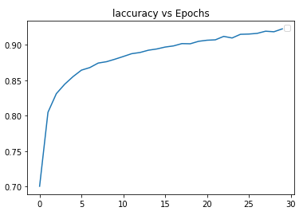 \
The train accuracy: 92.23% \

d)	Evaluate on the test set (in fashion-mnist_test.csv) \
The test Accuracy: 89.579% \

### Second technique: \
a)	I used 5-fold cross validation on fashion-mnist_train dataset. \
b)	Plot the accuracies vs epochs, and training loss vs epochs for each fold. \
The accuracies vs epochs:
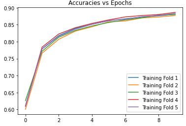 \
 
The validation loss vs Folds: \
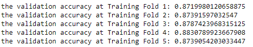 \
The training loss vs epochs: \
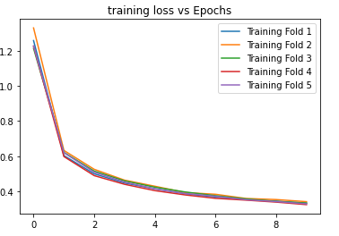 \

c)	Get average training, and testing accuracies: \
	Train average accuracy: 88.167% \
	Test average accuracy: 87.25% 

## Third technique:
I have used transfer learning: \
a)	 I have used a pretrained VGG16 model on ImageNet, then use this model to train our fashion-mnist_train dataset through excluding the last 4 layers, and add new output layer, and train the weights of the output layer only while freezing the other weights, then evaluate resulted model on the test set (in fashion-mnist_test.csv). \
The train accuracy: 82.6% \
The test accuracy: 82.678% \
b)	I have used a pretrained VGG19 model on ImageNet, then use this model to train our fashion-mnist_train dataset through excluding the last 4 layers, and add new output layer, and train the weights of the output layer only while freezing the other weights, then evaluate resulted model on the test set (in fashion-mnist_test.csv). \
The train accuracy: 82.95% \
The test accuracy: 82.94% 

## The comparison of the three techniques:
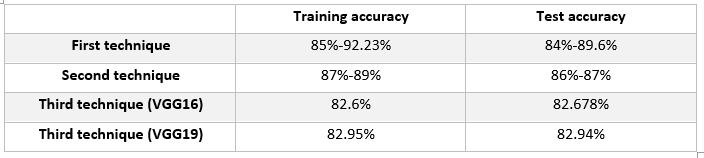 \

I got the best results from the first technique and second techniques, but the third technique was not the best because fashion mnist is slightly different from ImageNet. 

